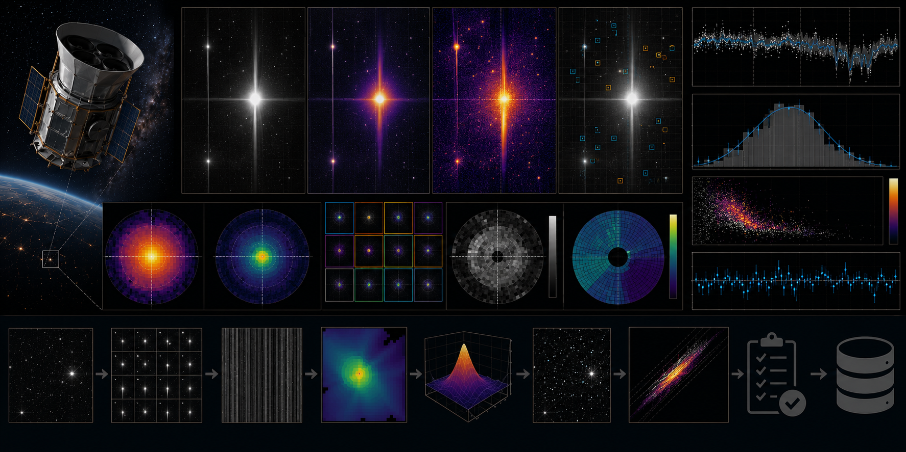

# TESS Scattered-Light Quality-Flag Audit



> **Curation:** `BUILD_FIRST` · Priority 9.0/10 · real public TESS light curves/TPFs

## Scientific question

How do TESS quality-mask policies alter flux scatter and background behaviour near scattered-light-affected cadences?

## What this repository contributes

A focused audit layer; not a replacement for Lightkurve, SPOC, QLP or MAST.

## Key result

Across 3 real TESS Sector 40 SPOC 2-minute light-curve files, the median Straylight2 (scattered-light) quality-flag fraction is 0.0 (n=3) — directly confirmed by inspecting the raw QUALITY column values in each downloaded file (only bits 8/32/128/512 are ever set; bit 4096, Straylight2, never is). This is a genuine null result for this specific small deterministic sample, not a claim that no TESS target ever shows scattered-light contamination. All three mask policies (default/hard/hardest) excluded an identical mean of 699.3 cadences per target from other, more common quality bits, with a median scatter ratio of ~1.0014 across all three — consistent with those excluded cadences not being unusually noisy for this sample. The synthetic injection-recovery gate independently confirmed the pipeline correctly flags and recovers an elevated scatter ratio when a known excess-scatter, elevated-background segment is injected.

## Reproducing this result

```bash
python -m venv .venv
# Windows PowerShell
.venv\Scripts\Activate.ps1
python -m pip install -e ".[dev]"
pytest -q
python scripts/run_analysis.py --demo
python scripts/make_figures.py --demo
```

The demo path above uses clearly-labelled synthetic data for a fast smoke test. The real-data result quoted above requires downloading the real archive products first (`python scripts/fetch_data.py --i-have-authorization`), then `python scripts/run_analysis.py` and `python scripts/make_figures.py` without `--demo`.

For the web dashboard:

```bash
cd web-react
npm install
npm run dev
```

## Research documentation

- `CURATION_STATUS.md`
- `docs/RESEARCH_BLUEPRINT.md`
- `docs/DATASET_PLAN.md`
- `docs/LITERATURE_SEEDS.md`
- `docs/VALIDATION_CONTRACT.md`
- `docs/FIGURE_AND_UI_SPEC.md`

## Reproducibility and FAIR practice

All real inputs require product IDs, retrieval times, checksums, source terms and deterministic selection manifests. Derived results record the software commit and configuration hash.

## Limitations

- A focused audit layer over existing TESS quality flags; not a replacement for Lightkurve, SPOC, QLP or MAST.
- The real sample (3 Sector 40 targets) is a bounded first-release check and shows zero Straylight2-flagged cadences for this specific sample — not a general claim about scattered-light prevalence across TESS.
- Final literature metadata (quality-bit constants) was cross-checked directly against real Sector 1/40 data-release notes and Lightkurve's source, not assumed from memory.

## Author

Biswajit Jana

## Licence

BSD-3-Clause for original code. Mission/archive products retain their original terms.
